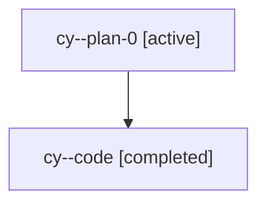

# Family: cy

Owner: `bbugyi200.athena` · Hood: `cy` · Members: 2

## Lineage

The diagram is an optional enhancement; the ordered table below contains the same lineage in accessible text.

| Role | Agent | State | Model / provider | Timing | Commits | Prompt | Chat |
|---|---|---|---|---|---:|---|---|
| plan-0 | cy--plan-0 | active | claude-fable-5 / claude | 2026-07-18T10:35:38.864493+00:00 | 0 | [Prompt](../agents/bbugyi200.athena.cy--plan-0/prompt.md) | [Chat](../agents/bbugyi200.athena.cy--plan-0/chat.md) |
| code | cy--code | completed | gpt-5.6-sol / codex | 2026-07-18T10:49:04.610085+00:00 | 1 | — | [Chat](../agents/bbugyi200.athena.cy--code/chat.md) |
