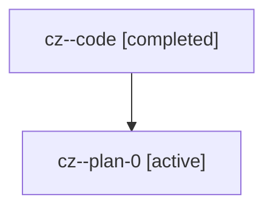

# Family: cz

[Agent Hoods](../README.md) / [bbugyi200](../users/bbugyi200/README.md) / [athena](../users/bbugyi200/machines/athena/README.md) / [cz](../users/bbugyi200/machines/athena/hoods/cz/README.md) / cz

Owner: `bbugyi200.athena` · Hood: `cz` · Members: 2

## Lineage

The diagram is an optional enhancement; the ordered table below contains the same lineage in accessible text.

| Role | Agent | State | Model / provider | Timing | Commits | Prompt | Chat |
|---|---|---|---|---|---:|---|---|
| code | cz--code | completed | gpt-5.6-sol / codex | 2026-07-18T10:52:10.661640+00:00 | [1](../agents/bbugyi200.athena.cz--code/README.md#commits) | — | [Chat](../agents/bbugyi200.athena.cz--code/chat.md) |
| plan-0 | cz--plan-0 | active | gpt-5.6-sol / codex | 2026-07-18T10:48:43.730817+00:00 | 0 | [Prompt](../agents/bbugyi200.athena.cz--plan-0/prompt.md) | [Chat](../agents/bbugyi200.athena.cz--plan-0/chat.md) |

## Commits

| Role | Repo | Commit | Subject | Committed |
|---|---|---|---|---|
| code | sase | [`64f5608`](https://github.com/sase-org/sase/commit/64f560802da4f19a7acf916d3107f1cdc08e89c6) | feat(ace): view prompt jump images in terminal | 2026-07-18 11:03:55 UTC |
