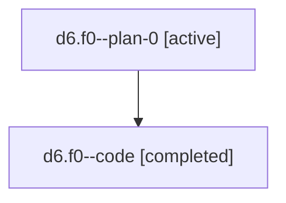

# Family: d6.f0

[Agent Hoods](../README.md) / [bbugyi200](../users/bbugyi200/README.md) / [athena](../users/bbugyi200/machines/athena/README.md) / [d6](../users/bbugyi200/machines/athena/hoods/d6/README.md) / d6.f0

Owner: `bbugyi200.athena` · Hood: `d6` · Members: 2

## Lineage

The diagram is an optional enhancement; the ordered table below contains the same lineage in accessible text.

| Role | Agent | State | Model / provider | Timing | Commits | Prompt | Chat |
|---|---|---|---|---|---:|---|---|
| plan-0 | d6.f0--plan-0 | active | gpt-5.6-sol / codex | 2026-07-18T11:41:36.308622+00:00 | 0 | [Prompt](../agents/bbugyi200.athena.d6.f0--plan-0/prompt.md) | [Chat](../agents/bbugyi200.athena.d6.f0--plan-0/chat.md) |
| code | d6.f0--code | completed | gpt-5.6-sol / codex | 2026-07-18T11:44:04.259002+00:00 | [1](../agents/bbugyi200.athena.d6.f0--code/README.md#commits) | — | [Chat](../agents/bbugyi200.athena.d6.f0--code/chat.md) |

## Commits

| Role | Repo | Commit | Subject | Committed |
|---|---|---|---|---|
| code | sase | [`60d2960`](https://github.com/sase-org/sase/commit/60d29600174e9dbe5e7c101efd7800bf1f7bca0a) | fix(plan-gate): label epic approval action as Epic | 2026-07-18 11:54:34 UTC |

## Neighbors

| Agent | Relation | State |
|---|---|---|
| [d6](../agents/bbugyi200.athena.d6/README.md) | ancestor | active |
| [d6.f1](bbugyi200.athena.d6.f1.md) (family · 2) | d6 hood | active 1, completed 1 |
| [d6.f1.f0](../agents/bbugyi200.athena.d6.f1.f0/README.md) | d6 hood | active |
| [d6.f1.w1](bbugyi200.athena.d6.f1.w1.md) (family · 2) | d6 hood | active 1, completed 1 |
