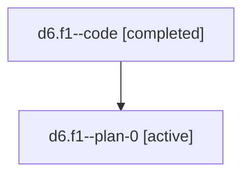

# Family: d6.f1

[Agent Hoods](../README.md) / [bbugyi200](../users/bbugyi200/README.md) / [athena](../users/bbugyi200/machines/athena/README.md) / [d6](../users/bbugyi200/machines/athena/hoods/d6/README.md) / d6.f1

Owner: `bbugyi200.athena` · Hood: `d6` · Members: 2

## Lineage

The diagram is an optional enhancement; the ordered table below contains the same lineage in accessible text.

| Role | Agent | State | Model / provider | Timing | Commits | Prompt | Chat |
|---|---|---|---|---|---:|---|---|
| code | d6.f1--code | completed | gpt-5.6-sol / codex | 2026-07-18T12:23:20.918028+00:00 | [1](../agents/bbugyi200.athena.d6.f1--code/README.md#commits) | — | [Chat](../agents/bbugyi200.athena.d6.f1--code/chat.md) |
| plan-0 | d6.f1--plan-0 | active | gpt-5.6-sol / codex | 2026-07-18T12:20:02.224463+00:00 | 0 | [Prompt](../agents/bbugyi200.athena.d6.f1--plan-0/prompt.md) | [Chat](../agents/bbugyi200.athena.d6.f1--plan-0/chat.md) |

## Commits

| Role | Repo | Commit | Subject | Committed |
|---|---|---|---|---|
| code | sase | [`dc09732`](https://github.com/sase-org/sase/commit/dc09732399aa651f54579f753c9234b08c6d66d9) | fix: label tale plan submit action | 2026-07-18 08:35:01 EDT |

## Neighbors

| Agent | Relation | State |
|---|---|---|
| [d6](../agents/bbugyi200.athena.d6/README.md) | ancestor | active |
| [d6.f1.f0](../agents/bbugyi200.athena.d6.f1.f0/README.md) | descendant | active |
| [d6.f1.w1](bbugyi200.athena.d6.f1.w1.md) (family · 2) | descendant | active 1, completed 1 |
| [d6.f1.w1](../agents/bbugyi200.athena.d6.f1.w1/README.md) | descendant | completed |
| [d6.f0](bbugyi200.athena.d6.f0.md) (family · 2) | d6 hood | active 1, completed 1 |
| [d6.f0](../agents/bbugyi200.athena.d6.f0/README.md) | d6 hood | completed |
