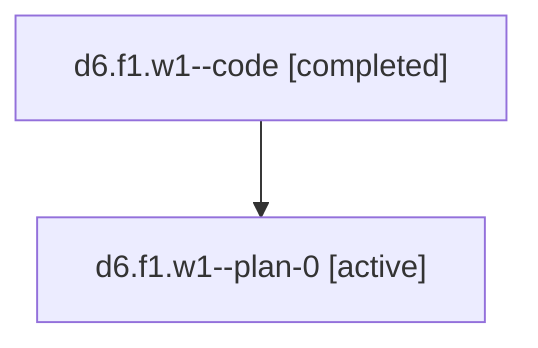

# Family: d6.f1.w1

[Agent Hoods](../README.md) / [bbugyi200](../users/bbugyi200/README.md) / [athena](../users/bbugyi200/machines/athena/README.md) / [d6](../users/bbugyi200/machines/athena/hoods/d6/README.md) / d6.f1.w1

Owner: `bbugyi200.athena` · Hood: `d6` · Members: 2

## Lineage

The diagram is an optional enhancement; the ordered table below contains the same lineage in accessible text.

| Role | Agent | State | Model / provider | Timing | Commits | Prompt | Chat |
|---|---|---|---|---|---:|---|---|
| code | d6.f1.w1--code | completed | gpt-5.6-sol / codex | 2026-07-18T12:41:46.398420+00:00 | [1](../agents/bbugyi200.athena.d6.f1.w1--code/README.md#commits) | — | [Chat](../agents/bbugyi200.athena.d6.f1.w1--code/chat.md) |
| plan-0 | d6.f1.w1--plan-0 | active | gpt-5.6-sol / codex | 2026-07-18T12:35:20.747518+00:00 | 0 | [Prompt](../agents/bbugyi200.athena.d6.f1.w1--plan-0/prompt.md) | [Chat](../agents/bbugyi200.athena.d6.f1.w1--plan-0/chat.md) |

## Commits

| Role | Repo | Commit | Subject | Committed |
|---|---|---|---|---|
| code | sase | [`005f431`](https://github.com/sase-org/sase/commit/005f431eb8e50c8ea187145d6c9eeb612ba32b88) | feat(gates)!: add canonical primary branch submission | 2026-07-18 13:10:32 UTC |

## Neighbors

| Agent | Relation | State |
|---|---|---|
| [d6.f1](bbugyi200.athena.d6.f1.md) (family · 2) | ancestor | active 1, completed 1 |
| [d6](../agents/bbugyi200.athena.d6/README.md) | ancestor | active |
| [d6.f1.f0](../agents/bbugyi200.athena.d6.f1.f0/README.md) | d6.f1 hood | active |
| [d6.f0](bbugyi200.athena.d6.f0.md) (family · 2) | d6 hood | active 1, completed 1 |
