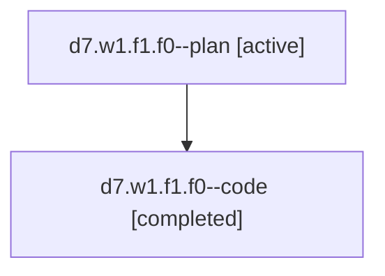

# Family: d7.w1.f1.f0

[Agent Hoods](../README.md) / [bbugyi200](../users/bbugyi200/README.md) / [athena](../users/bbugyi200/machines/athena/README.md) / [d7](../users/bbugyi200/machines/athena/hoods/d7/README.md) / d7.w1.f1.f0

Owner: `bbugyi200.athena` · Hood: `d7` · Members: 2

## Lineage

The diagram is an optional enhancement; the ordered table below contains the same lineage in accessible text.

| Role | Agent | State | Model / provider | Timing | Commits | Prompt | Chat |
|---|---|---|---|---|---:|---|---|
| plan | d7.w1.f1.f0--plan | active | claude-fable-5 / claude | 2026-07-18T13:37:34.167673+00:00 | 0 | [Prompt](../agents/bbugyi200.athena.d7.w1.f1.f0--plan/prompt.md) | [Chat](../agents/bbugyi200.athena.d7.w1.f1.f0--plan/chat.md) |
| code | d7.w1.f1.f0--code | completed | gpt-5.6-sol / codex | 2026-07-18T13:54:51.842659+00:00 | [1](../agents/bbugyi200.athena.d7.w1.f1.f0--code/README.md#commits) | — | [Chat](../agents/bbugyi200.athena.d7.w1.f1.f0--code/chat.md) |

## Commits

| Role | Repo | Commit | Subject | Committed (UTC) |
|---|---|---|---|---|
| code | sase | [`a1152a8`](https://github.com/sase-org/sase/commit/a1152a88c72f1362d8f9c1fd802387c7288f8117) | feat(tui): unify clan and family row identities | 2026-07-18 14:32:09 |

## Neighbors

| Agent | Relation | State |
|---|---|---|
| [d7.w1.f1](../agents/bbugyi200.athena.d7.w1.f1/README.md) | ancestor | completed |
| [d7.w1](../agents/bbugyi200.athena.d7.w1/README.md) | ancestor | completed |
| [d7](../agents/bbugyi200.athena.d7/README.md) | ancestor | active |
| [d7.w1.f1.f0.f0](bbugyi200.athena.d7.w1.f1.f0.f0.md) (family · 2) | descendant | active 1, completed 1 |
| [d7.w1.f1.f0.f0](../agents/bbugyi200.athena.d7.w1.f1.f0.f0/README.md) | descendant | completed |
| [d7.w1.f1.f0.f0.f0](../agents/bbugyi200.athena.d7.w1.f1.f0.f0.f0/README.md) | descendant | active |
| [d7.w1.f1.f0.f1](../agents/bbugyi200.athena.d7.w1.f1.f0.f1/README.md) | descendant | active |
| [d7.w1.f1.w0](../agents/bbugyi200.athena.d7.w1.f1.w0/README.md) | d7.w1.f1 hood | active |
| [d7.w1.f0.w0](../agents/bbugyi200.athena.d7.w1.f0.w0/README.md) | d7.w1 hood | waiting |
| [d7.w0.f0](../agents/bbugyi200.athena.d7.w0.f0/README.md) | d7 hood | waiting |
| [d7.w0.w0](../agents/bbugyi200.athena.d7.w0.w0/README.md) | d7 hood | active |
