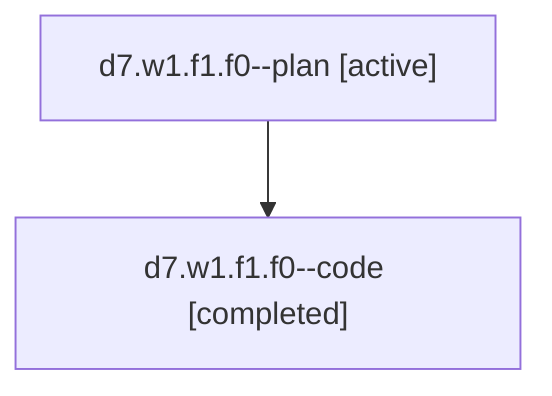

# Family: d7.w1.f1.f0

Owner: `bbugyi200.athena` · Hood: `d7` · Members: 2

## Lineage

The diagram is an optional enhancement; the ordered table below contains the same lineage in accessible text.

| Role | Agent | State | Model / provider | Timing | Commits | Prompt | Chat |
|---|---|---|---|---|---:|---|---|
| plan | d7.w1.f1.f0--plan | active | claude-fable-5 / claude | 2026-07-18T13:37:34.167673+00:00 | 0 | [Prompt](../agents/bbugyi200.athena.d7.w1.f1.f0--plan/prompt.md) | [Chat](../agents/bbugyi200.athena.d7.w1.f1.f0--plan/chat.md) |
| code | d7.w1.f1.f0--code | completed | gpt-5.6-sol / codex | 2026-07-18T13:54:51.842659+00:00 | 1 | — | [Chat](../agents/bbugyi200.athena.d7.w1.f1.f0--code/chat.md) |
