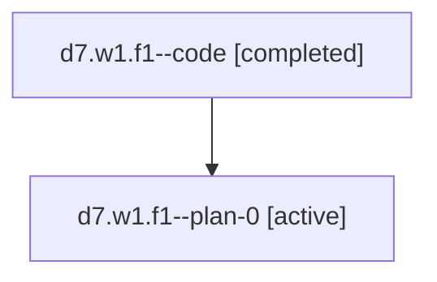

# Family: d7.w1.f1

Owner: `bbugyi200.athena` · Hood: `d7` · Members: 2

## Lineage

The diagram is an optional enhancement; the ordered table below contains the same lineage in accessible text.

| Role | Agent | State | Model / provider | Timing | Commits | Prompt | Chat |
|---|---|---|---|---|---:|---|---|
| code | d7.w1.f1--code | completed | gpt-5.6-sol / codex | 2026-07-18T13:04:13.359243+00:00 | 1 | — | [Chat](../agents/bbugyi200.athena.d7.w1.f1--code/chat.md) |
| plan-0 | d7.w1.f1--plan-0 | active | opus / claude | 2026-07-18T12:54:29.182399+00:00 | 0 | [Prompt](../agents/bbugyi200.athena.d7.w1.f1--plan-0/prompt.md) | [Chat](../agents/bbugyi200.athena.d7.w1.f1--plan-0/chat.md) |
