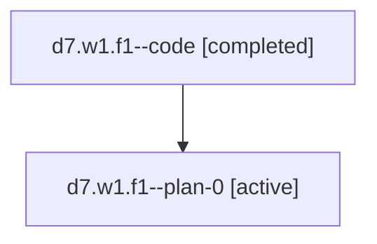

# Family: d7.w1.f1

[Agent Hoods](../README.md) / [bbugyi200](../users/bbugyi200/README.md) / [athena](../users/bbugyi200/machines/athena/README.md) / [d7](../users/bbugyi200/machines/athena/hoods/d7/README.md) / d7.w1.f1

Owner: `bbugyi200.athena` · Hood: `d7` · Members: 2

## Lineage

The diagram is an optional enhancement; the ordered table below contains the same lineage in accessible text.

| Role | Agent | State | Model / provider | Timing | Commits | Prompt | Chat |
|---|---|---|---|---|---:|---|---|
| code | d7.w1.f1--code | completed | gpt-5.6-sol / codex | 2026-07-18T13:04:13.359243+00:00 | [1](../agents/bbugyi200.athena.d7.w1.f1--code/README.md#commits) | — | [Chat](../agents/bbugyi200.athena.d7.w1.f1--code/chat.md) |
| plan-0 | d7.w1.f1--plan-0 | active | opus / claude | 2026-07-18T12:54:29.182399+00:00 | 0 | [Prompt](../agents/bbugyi200.athena.d7.w1.f1--plan-0/prompt.md) | [Chat](../agents/bbugyi200.athena.d7.w1.f1--plan-0/chat.md) |

## Commits

| Role | Repo | Commit | Subject | Committed |
|---|---|---|---|---|
| code | sase | [`4c20b1b`](https://github.com/sase-org/sase/commit/4c20b1bdb1d62ceea0c52532cff6691e9c198b23) | feat(ace): distinguish agent family rows | 2026-07-18 09:30:43 EDT |

## Neighbors

| Agent | Relation | State |
|---|---|---|
| [d7.w1](../agents/bbugyi200.athena.d7.w1/README.md) | ancestor | completed |
| [d7](../agents/bbugyi200.athena.d7/README.md) | ancestor | active |
| [d7.w1.f1.f0](bbugyi200.athena.d7.w1.f1.f0.md) (family · 2) | descendant | active 1, completed 1 |
| [d7.w1.f1.f0](../agents/bbugyi200.athena.d7.w1.f1.f0/README.md) | descendant | completed |
| [d7.w1.f1.f0.f0](bbugyi200.athena.d7.w1.f1.f0.f0.md) (family · 2) | descendant | active 1, completed 1 |
| [d7.w1.f1.f0.f0](../agents/bbugyi200.athena.d7.w1.f1.f0.f0/README.md) | descendant | completed |
| [d7.w1.f1.f0.f0.f0](../agents/bbugyi200.athena.d7.w1.f1.f0.f0.f0/README.md) | descendant | active |
| [d7.w1.f1.f0.f1](../agents/bbugyi200.athena.d7.w1.f1.f0.f1/README.md) | descendant | active |
| [d7.w1.f1.w0](../agents/bbugyi200.athena.d7.w1.f1.w0/README.md) | descendant | active |
| [d7.w1.f0.w0](../agents/bbugyi200.athena.d7.w1.f0.w0/README.md) | d7.w1 hood | waiting |
| [d7.w0.f0](../agents/bbugyi200.athena.d7.w0.f0/README.md) | d7 hood | waiting |
| [d7.w0.w0](../agents/bbugyi200.athena.d7.w0.w0/README.md) | d7 hood | active |
