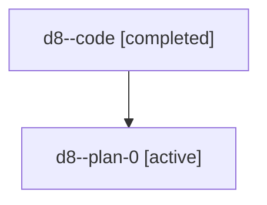

# Family: d8

[Agent Hoods](../README.md) / [bbugyi200](../users/bbugyi200/README.md) / [athena](../users/bbugyi200/machines/athena/README.md) / [d8](../users/bbugyi200/machines/athena/hoods/d8/README.md) / d8

Owner: `bbugyi200.athena` · Hood: `d8` · Members: 2

## Lineage

The diagram is an optional enhancement; the ordered table below contains the same lineage in accessible text.

| Role | Agent | State | Model / provider | Timing | Commits | Prompt | Chat |
|---|---|---|---|---|---:|---|---|
| code | d8--code | completed | gpt-5.6-sol / codex | 2026-07-18T11:43:09.455704+00:00 | [1](../agents/bbugyi200.athena.d8--code/README.md#commits) | — | [Chat](../agents/bbugyi200.athena.d8--code/chat.md) |
| plan-0 | d8--plan-0 | active | gpt-5.6-sol / codex | 2026-07-18T11:34:28.151774+00:00 | 0 | [Prompt](../agents/bbugyi200.athena.d8--plan-0/prompt.md) | [Chat](../agents/bbugyi200.athena.d8--plan-0/chat.md) |

## Commits

| Role | Repo | Commit | Subject | Committed |
|---|---|---|---|---|
| code | sase | [`a27479e`](https://github.com/sase-org/sase/commit/a27479e795300e33aff8d1d5cd94ffe437e36334) | feat(ace): add alias options to model picker | 2026-07-18 12:06:59 UTC |
