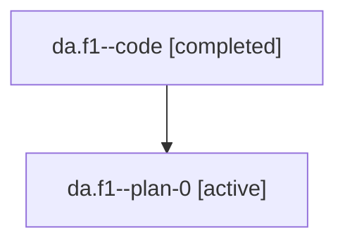

# Family: da.f1

[Agent Hoods](../README.md) / [bbugyi200](../users/bbugyi200/README.md) / [athena](../users/bbugyi200/machines/athena/README.md) / [da](../users/bbugyi200/machines/athena/hoods/da/README.md) / da.f1

Owner: `bbugyi200.athena` · Hood: `da` · Members: 2

## Lineage

The diagram is an optional enhancement; the ordered table below contains the same lineage in accessible text.

| Role | Agent | State | Model / provider | Timing | Commits | Prompt | Chat |
|---|---|---|---|---|---:|---|---|
| code | da.f1--code | completed | gpt-5.6-sol / codex | 2026-07-18T12:56:34.315016+00:00 | [1](../agents/bbugyi200.athena.da.f1--code/README.md#commits) | — | [Chat](../agents/bbugyi200.athena.da.f1--code/chat.md) |
| plan-0 | da.f1--plan-0 | active | gpt-5.6-sol / codex | 2026-07-18T12:37:49.650312+00:00 | 0 | [Prompt](../agents/bbugyi200.athena.da.f1--plan-0/prompt.md) | [Chat](../agents/bbugyi200.athena.da.f1--plan-0/chat.md) |

## Commits

| Role | Commit | Subject | Committed (UTC) |
|---|---|---|---|
| code | [`d68b0a4`](https://github.com/sase-org/sase/commit/d68b0a461f8dd963b5506136e10700c7cb7b3994) | fix(ace): keep saved snippets live in prompt catalog | 2026-07-18 13:16:13 |

## Neighbors

| Agent | Relation | State |
|---|---|---|
| [da](../agents/bbugyi200.athena.da/README.md) | ancestor | completed |
