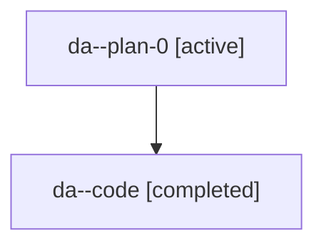

# Family: da

[Agent Hoods](../README.md) / [bbugyi200](../users/bbugyi200/README.md) / [athena](../users/bbugyi200/machines/athena/README.md) / [da](../users/bbugyi200/machines/athena/hoods/da/README.md) / da

Owner: `bbugyi200.athena` · Hood: `da` · Members: 2

## Lineage

The diagram is an optional enhancement; the ordered table below contains the same lineage in accessible text.

| Role | Agent | State | Model / provider | Timing | Commits | Prompt | Chat |
|---|---|---|---|---|---:|---|---|
| plan-0 | da--plan-0 | active | gpt-5.6-sol / codex | 2026-07-18T12:13:51.438791+00:00 | 0 | [Prompt](../agents/bbugyi200.athena.da--plan-0/prompt.md) | [Chat](../agents/bbugyi200.athena.da--plan-0/chat.md) |
| code | da--code | completed | gpt-5.6-sol / codex | 2026-07-18T12:19:24.043671+00:00 | [1](../agents/bbugyi200.athena.da--code/README.md#commits) | — | [Chat](../agents/bbugyi200.athena.da--code/chat.md) |

## Commits

| Role | Repo | Commit | Subject | Committed |
|---|---|---|---|---|
| code | sase | [`2ac99da`](https://github.com/sase-org/sase/commit/2ac99dab516508ae27d12fe22ebd1f292b5ce1be) | feat(ace)!: add Ctrl+X xprompt snippet chord | 2026-07-18 12:37:20 UTC |

## Neighbors

| Agent | Relation | State |
|---|---|---|
| [da.f1](bbugyi200.athena.da.f1.md) (family · 2) | descendant | active 1, completed 1 |
