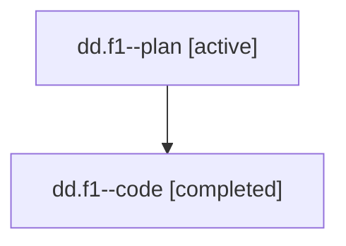

# Family: dd.f1

[Agent Hoods](../README.md) / [bbugyi200](../users/bbugyi200/README.md) / [athena](../users/bbugyi200/machines/athena/README.md) / [dd](../users/bbugyi200/machines/athena/hoods/dd/README.md) / dd.f1

Owner: `bbugyi200.athena` · Hood: `dd` · Members: 2

## Lineage

The diagram is an optional enhancement; the ordered table below contains the same lineage in accessible text.

| Role | Agent | State | Model / provider | Timing | Commits | Prompt | Chat |
|---|---|---|---|---|---:|---|---|
| plan | dd.f1--plan | active | claude-fable-5 / claude | 2026-07-18T14:34:10.314142+00:00 | 0 | [Prompt](../agents/bbugyi200.athena.dd.f1--plan/prompt.md) | [Chat](../agents/bbugyi200.athena.dd.f1--plan/chat.md) |
| code | dd.f1--code | completed | gpt-5.6-sol / codex | 2026-07-18T14:40:54.219327+00:00 | [1](../agents/bbugyi200.athena.dd.f1--code/README.md#commits) | — | [Chat](../agents/bbugyi200.athena.dd.f1--code/chat.md) |

## Commits

| Role | Commit | Subject | Committed (UTC) |
|---|---|---|---|
| code | [`0fa8b64`](https://github.com/sase-org/sase/commit/0fa8b643ef3bc0367091c5d56c6be301f8a75564) | feat(tui): add responsive gate review workbench | 2026-07-18 15:05:36 |

## Neighbors

| Agent | Relation | State |
|---|---|---|
| [dd](../agents/bbugyi200.athena.dd/README.md) | ancestor | completed |
