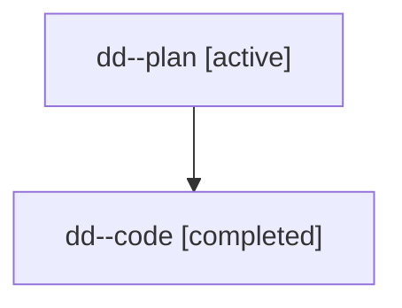

# Family: dd

[Agent Hoods](../README.md) / [bbugyi200](../users/bbugyi200/README.md) / [athena](../users/bbugyi200/machines/athena/README.md) / [dd](../users/bbugyi200/machines/athena/hoods/dd/README.md) / dd

Owner: `bbugyi200.athena` · Hood: `dd` · Members: 2

## Lineage

The diagram is an optional enhancement; the ordered table below contains the same lineage in accessible text.

| Role | Agent | State | Model / provider | Timing | Commits | Prompt | Chat |
|---|---|---|---|---|---:|---|---|
| plan | dd--plan | active | gpt-5.6-sol / codex | 2026-07-18T13:56:04.444105+00:00 | 0 | [Prompt](../agents/bbugyi200.athena.dd--plan/prompt.md) | [Chat](../agents/bbugyi200.athena.dd--plan/chat.md) |
| code | dd--code | completed | gpt-5.6-sol / codex | 2026-07-18T14:01:25.998332+00:00 | [1](../agents/bbugyi200.athena.dd--code/README.md#commits) | — | [Chat](../agents/bbugyi200.athena.dd--code/chat.md) |

## Commits

| Role | Repo | Commit | Subject | Committed |
|---|---|---|---|---|
| code | sase | [`6fd595d`](https://github.com/sase-org/sase/commit/6fd595daac75ab88e60d84a041a3c8c52fb43f43) | feat(ace): label primary gate footer action | 2026-07-18 10:32:59 EDT |

## Neighbors

| Agent | Relation | State |
|---|---|---|
| [dd.f1](bbugyi200.athena.dd.f1.md) (family · 2) | descendant | active 1, completed 1 |
