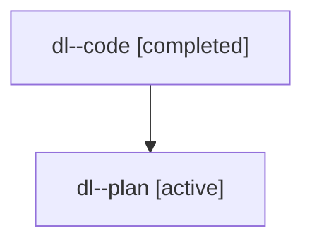

# Family: dl

[Agent Hoods](../README.md) / [bbugyi200](../users/bbugyi200/README.md) / [athena](../users/bbugyi200/machines/athena/README.md) / [dl](../users/bbugyi200/machines/athena/hoods/dl/README.md) / dl

Owner: `bbugyi200.athena` · Hood: `dl` · Members: 2

## Lineage

The diagram is an optional enhancement; the ordered table below contains the same lineage in accessible text.

| Role | Agent | State | Model / provider | Timing | Commits | Prompt | Chat |
|---|---|---|---|---|---:|---|---|
| code | dl--code | completed | gpt-5.6-sol / codex | 2026-07-18T18:00:53.795208+00:00 | [1](../agents/bbugyi200.athena.dl--code/README.md#commits) | — | [Chat](../agents/bbugyi200.athena.dl--code/chat.md) |
| plan | dl--plan | active | gpt-5.6-sol / codex | 2026-07-18T17:55:32.519413+00:00 | 0 | [Prompt](../agents/bbugyi200.athena.dl--plan/prompt.md) | [Chat](../agents/bbugyi200.athena.dl--plan/chat.md) |

## Commits

| Role | Repo | Commit | Subject | Committed |
|---|---|---|---|---|
| code | sase | [`d477a09`](https://github.com/sase-org/sase/commit/d477a090f74fee4435ad1c7af565b0b3645a10fd) | fix(ace): use full height for overflowing agent panels | 2026-07-18 18:15:37 UTC |
