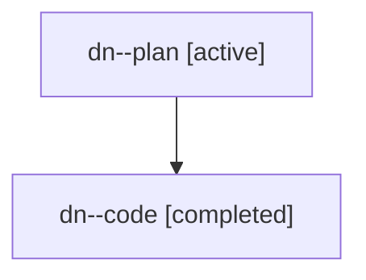

# Family: dn

[Agent Hoods](../README.md) / [bbugyi200](../users/bbugyi200/README.md) / [athena](../users/bbugyi200/machines/athena/README.md) / [dn](../users/bbugyi200/machines/athena/hoods/dn/README.md) / dn

Owner: `bbugyi200.athena` · Hood: `dn` · Members: 2

## Lineage

The diagram is an optional enhancement; the ordered table below contains the same lineage in accessible text.

| Role | Agent | State | Model / provider | Timing | Commits | Prompt | Chat |
|---|---|---|---|---|---:|---|---|
| plan | dn--plan | active | gpt-5.6-sol / codex | 2026-07-18T18:02:33.395590+00:00 | 0 | [Prompt](../agents/bbugyi200.athena.dn--plan/prompt.md) | [Chat](../agents/bbugyi200.athena.dn--plan/chat.md) |
| code | dn--code | completed | gpt-5.6-sol / codex | 2026-07-18T18:04:52.396619+00:00 | [1](../agents/bbugyi200.athena.dn--code/README.md#commits) | — | [Chat](../agents/bbugyi200.athena.dn--code/chat.md) |

## Commits

| Role | Repo | Commit | Subject | Committed (UTC) |
|---|---|---|---|---|
| code | sase | [`9c2f000`](https://github.com/sase-org/sase/commit/9c2f00092ee7adf636d499db24d58e034846ec69) | fix(plan-gate): distinguish tale launch icon | 2026-07-18 18:18:12 |
