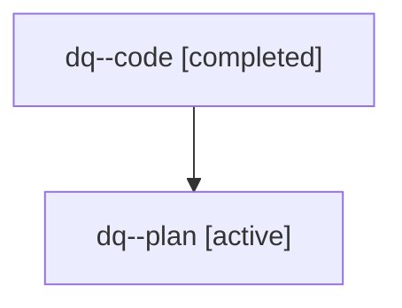

# Family: dq

[Agent Hoods](../README.md) / [bbugyi200](../users/bbugyi200/README.md) / [athena](../users/bbugyi200/machines/athena/README.md) / [dq](../users/bbugyi200/machines/athena/hoods/dq/README.md) / dq

Owner: `bbugyi200.athena` · Hood: `dq` · Members: 2

## Lineage

The diagram is an optional enhancement; the ordered table below contains the same lineage in accessible text.

| Role | Agent | State | Model / provider | Timing | Commits | Prompt | Chat |
|---|---|---|---|---|---:|---|---|
| code | dq--code | completed | gpt-5.6-sol / codex | 2026-07-18T18:38:07.176279+00:00 | [1](../agents/bbugyi200.athena.dq--code/README.md#commits) | — | [Chat](../agents/bbugyi200.athena.dq--code/chat.md) |
| plan | dq--plan | active | claude-fable-5 / claude | 2026-07-18T18:26:19.229381+00:00 | 0 | [Prompt](../agents/bbugyi200.athena.dq--plan/prompt.md) | [Chat](../agents/bbugyi200.athena.dq--plan/chat.md) |

## Commits

| Role | Commit | Subject | Committed (UTC) |
|---|---|---|---|
| code | [`25c87d4`](https://github.com/sase-org/sase/commit/25c87d40fbad0d5783c19ec901b624dbf5584cad) | feat(ace): add prompt history word completion | 2026-07-18 19:04:56 |
