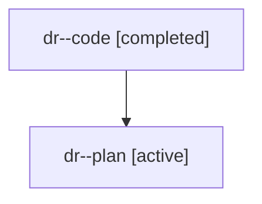

# Family: dr

[Agent Hoods](../README.md) / [bbugyi200](../users/bbugyi200/README.md) / [athena](../users/bbugyi200/machines/athena/README.md) / [dr](../users/bbugyi200/machines/athena/hoods/dr/README.md) / dr

Owner: `bbugyi200.athena` · Hood: `dr` · Members: 2

## Lineage

The diagram is an optional enhancement; the ordered table below contains the same lineage in accessible text.

| Role | Agent | State | Model / provider | Timing | Commits | Prompt | Chat |
|---|---|---|---|---|---:|---|---|
| code | dr--code | completed | gpt-5.6-sol / codex | 2026-07-18T18:48:48.618252+00:00 | [1](../agents/bbugyi200.athena.dr--code/README.md#commits) | — | [Chat](../agents/bbugyi200.athena.dr--code/chat.md) |
| plan | dr--plan | active | gpt-5.6-sol / codex | 2026-07-18T18:37:36.289366+00:00 | 0 | [Prompt](../agents/bbugyi200.athena.dr--plan/prompt.md) | [Chat](../agents/bbugyi200.athena.dr--plan/chat.md) |

## Commits

| Role | Repo | Commit | Subject | Committed |
|---|---|---|---|---|
| code | sase | [`bfdf0e8`](https://github.com/sase-org/sase/commit/bfdf0e87be08d27ad8e5ea5a9258328be4634756) | feat!: support clan-level tribe directives | 2026-07-18 15:32:45 EDT |
