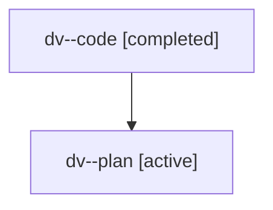

# Family: dv

Owner: `bbugyi200.athena` · Hood: `dv` · Members: 2

## Lineage

The diagram is an optional enhancement; the ordered table below contains the same lineage in accessible text.

| Role | Agent | State | Model / provider | Timing | Commits | Prompt | Chat |
|---|---|---|---|---|---:|---|---|
| code | dv--code | completed | gpt-5.6-sol / codex | 2026-07-18T19:41:19.883342+00:00 | 1 | — | [Chat](../agents/bbugyi200.athena.dv--code/chat.md) |
| plan | dv--plan | active | gpt-5.6-sol / codex | 2026-07-18T19:36:04.720992+00:00 | 0 | [Prompt](../agents/bbugyi200.athena.dv--plan/prompt.md) | [Chat](../agents/bbugyi200.athena.dv--plan/chat.md) |
