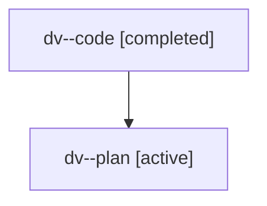

# Family: dv

[Agent Hoods](../README.md) / [bbugyi200](../users/bbugyi200/README.md) / [athena](../users/bbugyi200/machines/athena/README.md) / [dv](../users/bbugyi200/machines/athena/hoods/dv/README.md) / dv

Owner: `bbugyi200.athena` · Hood: `dv` · Members: 2

## Lineage

The diagram is an optional enhancement; the ordered table below contains the same lineage in accessible text.

| Role | Agent | State | Model / provider | Timing | Commits | Prompt | Chat |
|---|---|---|---|---|---:|---|---|
| code | dv--code | completed | gpt-5.6-sol / codex | 2026-07-18T19:41:19.883342+00:00 | [1](../agents/bbugyi200.athena.dv--code/README.md#commits) | — | [Chat](../agents/bbugyi200.athena.dv--code/chat.md) |
| plan | dv--plan | active | gpt-5.6-sol / codex | 2026-07-18T19:36:04.720992+00:00 | 0 | [Prompt](../agents/bbugyi200.athena.dv--plan/prompt.md) | [Chat](../agents/bbugyi200.athena.dv--plan/chat.md) |

## Commits

| Role | Repo | Commit | Subject | Committed |
|---|---|---|---|---|
| code | sase | [`ec9bdd0`](https://github.com/sase-org/sase/commit/ec9bdd0471ae1dfe3c4eb0d12350be962ffb909e) | fix(ace): restore agent status bucket priority | 2026-07-18 19:57:28 UTC |

## Neighbors

| Agent | Relation | State |
|---|---|---|
| [dv.f0](../agents/bbugyi200.athena.dv.f0/README.md) | descendant | active |
| [dv.f1](bbugyi200.athena.dv.f1.md) (family · 2) | descendant | active 1, completed 1 |
