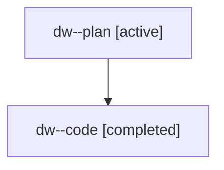

# Family: dw

[Agent Hoods](../README.md) / [bbugyi200](../users/bbugyi200/README.md) / [athena](../users/bbugyi200/machines/athena/README.md) / [dw](../users/bbugyi200/machines/athena/hoods/dw/README.md) / dw

Owner: `bbugyi200.athena` · Hood: `dw` · Members: 2

## Lineage

The diagram is an optional enhancement; the ordered table below contains the same lineage in accessible text.

| Role | Agent | State | Model / provider | Timing | Commits | Prompt | Chat |
|---|---|---|---|---|---:|---|---|
| plan | dw--plan | active | gpt-5.6-sol / codex | 2026-07-18T20:51:15.698123+00:00 | 0 | [Prompt](../agents/bbugyi200.athena.dw--plan/prompt.md) | [Chat](../agents/bbugyi200.athena.dw--plan/chat.md) |
| code | dw--code | completed | gpt-5.6-sol / codex | 2026-07-18T21:04:02.542766+00:00 | [1](../agents/bbugyi200.athena.dw--code/README.md#commits) | — | [Chat](../agents/bbugyi200.athena.dw--code/chat.md) |

## Commits

| Role | Commit | Subject | Committed (UTC) |
|---|---|---|---|
| code | [`97583b6`](https://github.com/sase-org/sase/commit/97583b66cabb67f41722ab779fc79223d9727373) | feat(ace): share prompt search register across panes | 2026-07-18 21:16:58 |
