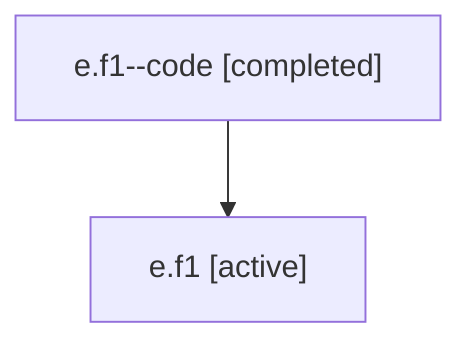

# Family: e.f1

[Agent Hoods](../README.md) / [bbugyi200](../users/bbugyi200/README.md) / [athena](../users/bbugyi200/machines/athena/README.md) / [e](../users/bbugyi200/machines/athena/hoods/e/README.md) / e.f1

Owner: `bbugyi200.athena` · Hood: `e` · Members: 2

## Lineage

The diagram is an optional enhancement; the ordered table below contains the same lineage in accessible text.

| Role | Agent | State | Model / provider | Timing | Commits | Prompt | Chat |
|---|---|---|---|---|---:|---|---|
| code | e.f1--code | completed | gpt-5.5 / codex | 2026-07-06T18:08:48.220236+00:00 | [1](../agents/bbugyi200.athena.e.f1--code/README.md#commits) | — | [Chat](../agents/bbugyi200.athena.e.f1--code/chat.md) |
| root | e.f1 | active | claude-fable-5 / claude | 2026-07-06T17:58:32.365923+00:00 | [2](../agents/bbugyi200.athena.e.f1/README.md#commits) | [Prompt](../agents/bbugyi200.athena.e.f1/prompt.md) | [Chat](../agents/bbugyi200.athena.e.f1/chat.md) |

## Commits

| Role | Repo | Commit | Subject | Committed |
|---|---|---|---|---|
| root | sase | [`9690feb`](https://github.com/sase-org/sase/commit/9690feb4cb59f3827cec2d27277b930155493b13) | chore: Add SDD prompt and plan for root\_agent\_status\_mirror | 2026-07-06 14:08:46 EDT |
| code | sase | [`7b53fec`](https://github.com/sase-org/sase/commit/7b53fec4b02faf76ac9cb8a285ab4f8f0ff4dc33) | fix(tui): mirror root wait status from child agents | 2026-07-06 14:25:20 EDT |
| root | sase | [`7b53fec`](https://github.com/sase-org/sase/commit/7b53fec4b02faf76ac9cb8a285ab4f8f0ff4dc33) | fix(tui): mirror root wait status from child agents | 2026-07-06 14:25:20 EDT |

## Neighbors

| Agent | Relation | State |
|---|---|---|
| [e](bbugyi200.athena.e.md) (family · 2) | ancestor | active 1, completed 1 |
