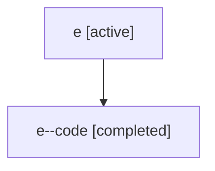

# Family: e

Owner: `bbugyi200.athena` · Hood: `e` · Members: 2

## Lineage

The diagram is an optional enhancement; the ordered table below contains the same lineage in accessible text.

| Role | Agent | State | Model / provider | Timing | Commits | Prompt | Chat |
|---|---|---|---|---|---:|---|---|
| root | e | active | claude-fable-5 / claude | 2026-07-06T17:19:45.582421+00:00 | 2 | [Prompt](../agents/bbugyi200.athena.e/prompt.md) | [Chat](../agents/bbugyi200.athena.e/chat.md) |
| code | e--code | completed | gpt-5.5 / codex | 2026-07-06T17:36:13.304010+00:00 | 0 | — | [Chat](../agents/bbugyi200.athena.e--code/chat.md) |
