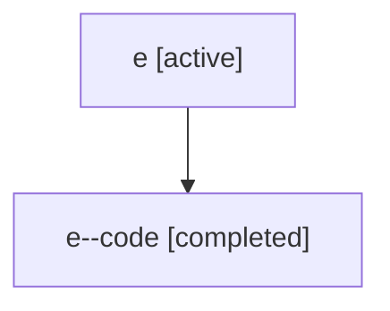

# Family: e

[Agent Hoods](../README.md) / [bbugyi200](../users/bbugyi200/README.md) / [athena](../users/bbugyi200/machines/athena/README.md) / [e](../users/bbugyi200/machines/athena/hoods/e/README.md) / e

Owner: `bbugyi200.athena` · Hood: `e` · Members: 2

## Lineage

The diagram is an optional enhancement; the ordered table below contains the same lineage in accessible text.

| Role | Agent | State | Model / provider | Timing | Commits | Prompt | Chat |
|---|---|---|---|---|---:|---|---|
| root | e | active | claude-fable-5 / claude | 2026-07-06T17:19:45.582421+00:00 | [1](../agents/bbugyi200.athena.e/README.md#commits) | [Prompt](../agents/bbugyi200.athena.e/prompt.md) | [Chat](../agents/bbugyi200.athena.e/chat.md) |
| code | e--code | completed | gpt-5.5 / codex | 2026-07-06T17:36:13.304010+00:00 | [1](../agents/bbugyi200.athena.e--code/README.md#commits) | — | [Chat](../agents/bbugyi200.athena.e--code/chat.md) |

## Commits

| Role | Repo | Commit | Subject | Committed |
|---|---|---|---|---|
| root | sase | [`8ed98b1`](https://github.com/sase-org/sase/commit/8ed98b1207df9c697ed7ab0086e1e8c490e0671b) | chore: Add SDD prompt and plan for fix\_wait\_time\_countdown\_and\_family\_queue\_deadlock | 2026-07-06 17:36:12 UTC |
| code | sase | [`5ca4379`](https://github.com/sase-org/sase/commit/5ca4379b7820886390dbac298e2fd366a2587804) | fix: unblock queued family waits | 2026-07-06 17:58:07 UTC |

## Neighbors

| Agent | Relation | State |
|---|---|---|
| [e.f1](bbugyi200.athena.e.f1.md) (family · 2) | descendant | active 1, completed 1 |
