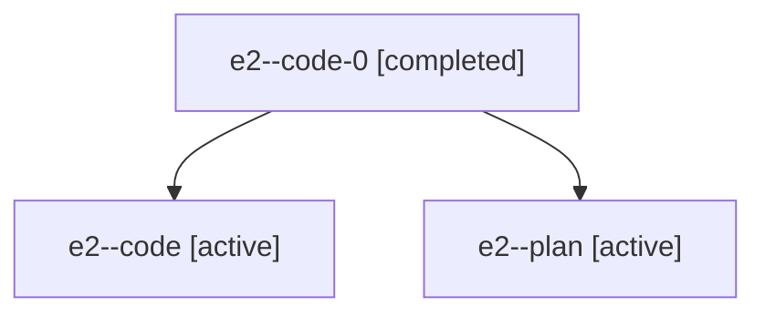

# Family: e2

Owner: `bbugyi200.athena` · Hood: `e2` · Members: 3

## Lineage

The diagram is an optional enhancement; the ordered table below contains the same lineage in accessible text.

| Role | Agent | State | Model / provider | Timing | Commits | Prompt | Chat |
|---|---|---|---|---|---:|---|---|
| code-0 | e2--code-0 | completed | gpt-5.6-sol / codex | 2026-07-18T23:35:09.963167+00:00 | 1 | — | [Chat](../agents/bbugyi200.athena.e2--code-0/chat.md) |
| code | e2--code | active | gpt-5.6-sol / codex | 2026-07-18T22:49:15.007960+00:00 | 1 | — | [Chat](../agents/bbugyi200.athena.e2--code/chat.md) |
| plan | e2--plan | active | claude-fable-5 / claude | 2026-07-18T22:44:52.549817+00:00 | 0 | [Prompt](../agents/bbugyi200.athena.e2--plan/prompt.md) | [Chat](../agents/bbugyi200.athena.e2--plan/chat.md) |
