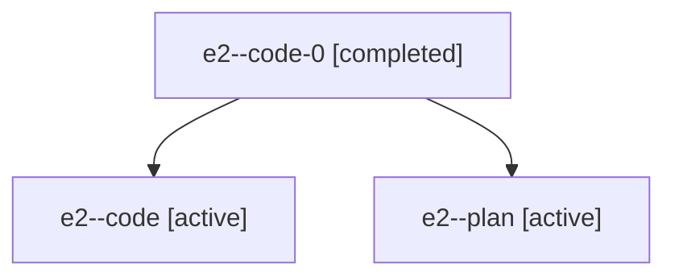

# Family: e2

[Agent Hoods](../README.md) / [bbugyi200](../users/bbugyi200/README.md) / [athena](../users/bbugyi200/machines/athena/README.md) / [e2](../users/bbugyi200/machines/athena/hoods/e2/README.md) / e2

Owner: `bbugyi200.athena` · Hood: `e2` · Members: 3

## Lineage

The diagram is an optional enhancement; the ordered table below contains the same lineage in accessible text.

| Role | Agent | State | Model / provider | Timing | Commits | Prompt | Chat |
|---|---|---|---|---|---:|---|---|
| code-0 | e2--code-0 | completed | gpt-5.6-sol / codex | 2026-07-18T23:35:09.963167+00:00 | [1](../agents/bbugyi200.athena.e2--code-0/README.md#commits) | — | [Chat](../agents/bbugyi200.athena.e2--code-0/chat.md) |
| code | e2--code | active | gpt-5.6-sol / codex | 2026-07-18T22:49:15.007960+00:00 | [1](../agents/bbugyi200.athena.e2--code/README.md#commits) | — | [Chat](../agents/bbugyi200.athena.e2--code/chat.md) |
| plan | e2--plan | active | claude-fable-5 / claude | 2026-07-18T22:44:52.549817+00:00 | 0 | [Prompt](../agents/bbugyi200.athena.e2--plan/prompt.md) | [Chat](../agents/bbugyi200.athena.e2--plan/chat.md) |

## Commits

| Role | Repo | Commit | Subject | Committed (UTC) |
|---|---|---|---|---|
| code | sase | [`97c0bf6`](https://github.com/sase-org/sase/commit/97c0bf6ad22fa5eec06705bfc9d533525d299cc8) | docs: define agent house in glossary | 2026-07-18 22:55:10 |
| code-0 | sase | [`8970fba`](https://github.com/sase-org/sase/commit/8970fbaab7987f1ad1330844f4fb1fa39496fa88) | revert: undo stale memory initialization output | 2026-07-18 23:40:20 |
