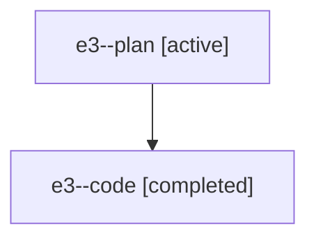

# Family: e3

Owner: `bbugyi200.athena` · Hood: `e3` · Members: 2

## Lineage

The diagram is an optional enhancement; the ordered table below contains the same lineage in accessible text.

| Role | Agent | State | Model / provider | Timing | Commits | Prompt | Chat |
|---|---|---|---|---|---:|---|---|
| plan | e3--plan | active | claude-fable-5 / claude | 2026-07-18T23:07:48.018327+00:00 | 0 | [Prompt](../agents/bbugyi200.athena.e3--plan/prompt.md) | [Chat](../agents/bbugyi200.athena.e3--plan/chat.md) |
| code | e3--code | completed | gpt-5.6-sol / codex | 2026-07-18T23:14:04.223029+00:00 | 1 | — | [Chat](../agents/bbugyi200.athena.e3--code/chat.md) |
