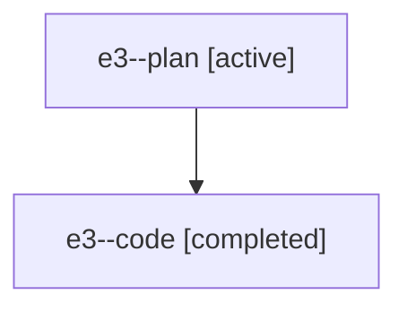

# Family: e3

[Agent Hoods](../README.md) / [bbugyi200](../users/bbugyi200/README.md) / [athena](../users/bbugyi200/machines/athena/README.md) / [e3](../users/bbugyi200/machines/athena/hoods/e3/README.md) / e3

Owner: `bbugyi200.athena` · Hood: `e3` · Members: 2

## Lineage

The diagram is an optional enhancement; the ordered table below contains the same lineage in accessible text.

| Role | Agent | State | Model / provider | Timing | Commits | Prompt | Chat |
|---|---|---|---|---|---:|---|---|
| plan | e3--plan | active | claude-fable-5 / claude | 2026-07-18T23:07:48.018327+00:00 | 0 | [Prompt](../agents/bbugyi200.athena.e3--plan/prompt.md) | [Chat](../agents/bbugyi200.athena.e3--plan/chat.md) |
| code | e3--code | completed | gpt-5.6-sol / codex | 2026-07-18T23:14:04.223029+00:00 | [1](../agents/bbugyi200.athena.e3--code/README.md#commits) | — | [Chat](../agents/bbugyi200.athena.e3--code/chat.md) |

## Commits

| Role | Repo | Commit | Subject | Committed |
|---|---|---|---|---|
| code | sase | [`ad45962`](https://github.com/sase-org/sase/commit/ad4596285d9bf394df688c2e0cd1cb41293dbebb) | fix(memory): avoid redundant init approval requests | 2026-07-18 19:24:57 EDT |
