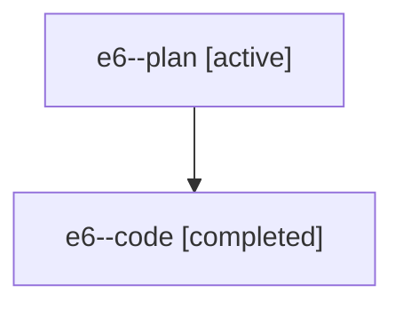

# Family: e6

[Agent Hoods](../README.md) / [bbugyi200](../users/bbugyi200/README.md) / [athena](../users/bbugyi200/machines/athena/README.md) / [e6](../users/bbugyi200/machines/athena/hoods/e6/README.md) / e6

Owner: `bbugyi200.athena` · Hood: `e6` · Members: 2

## Lineage

The diagram is an optional enhancement; the ordered table below contains the same lineage in accessible text.

| Role | Agent | State | Model / provider | Timing | Commits | Prompt | Chat |
|---|---|---|---|---|---:|---|---|
| plan | e6--plan | active | claude-fable-5 / claude | 2026-07-19T00:32:21.843661+00:00 | 0 | [Prompt](../agents/bbugyi200.athena.e6--plan/prompt.md) | [Chat](../agents/bbugyi200.athena.e6--plan/chat.md) |
| code | e6--code | completed | gpt-5.6-sol / codex | 2026-07-19T00:40:51.377888+00:00 | 0 | — | [Chat](../agents/bbugyi200.athena.e6--code/chat.md) |

## Neighbors

| Agent | Relation | State |
|---|---|---|
| [e6.f1](bbugyi200.athena.e6.f1.md) (family · 2) | descendant | active 1, completed 1 |
| [e6.f1](../agents/bbugyi200.athena.e6.f1/README.md) | descendant | completed |
