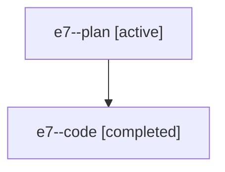

# Family: e7

[Agent Hoods](../README.md) / [bbugyi200](../users/bbugyi200/README.md) / [athena](../users/bbugyi200/machines/athena/README.md) / [e7](../users/bbugyi200/machines/athena/hoods/e7/README.md) / e7

Owner: `bbugyi200.athena` · Hood: `e7` · Members: 2

## Lineage

The diagram is an optional enhancement; the ordered table below contains the same lineage in accessible text.

| Role | Agent | State | Model / provider | Timing | Commits | Prompt | Chat |
|---|---|---|---|---|---:|---|---|
| plan | e7--plan | active | claude-fable-5 / claude | 2026-07-19T02:13:06.877974+00:00 | 0 | [Prompt](../agents/bbugyi200.athena.e7--plan/prompt.md) | [Chat](../agents/bbugyi200.athena.e7--plan/chat.md) |
| code | e7--code | completed | gpt-5.6-sol / codex | 2026-07-19T02:26:22.465233+00:00 | [1](../agents/bbugyi200.athena.e7--code/README.md#commits) | — | [Chat](../agents/bbugyi200.athena.e7--code/chat.md) |

## Commits

| Role | Commit | Subject | Committed (UTC) |
|---|---|---|---|
| code | [`292e9db`](https://github.com/sase-org/sase/commit/292e9db152c06ebc5b90ab88e051ddb0b1df7c93) | fix(agent): prevent ambient identity leaking across processes | 2026-07-19 02:48:22 |
