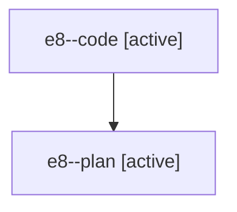

# Family: e8

Owner: `bbugyi200.athena` · Hood: `e8` · Members: 2

## Lineage

The diagram is an optional enhancement; the ordered table below contains the same lineage in accessible text.

| Role | Agent | State | Model / provider | Timing | Commits | Prompt | Chat |
|---|---|---|---|---|---:|---|---|
| code | e8--code | active | gpt-5.6-sol / codex | 2026-07-19T02:41:51.543244+00:00 | 1 | — | — |
| plan | e8--plan | active | claude-fable-5 / claude | 2026-07-19T02:33:01.586864+00:00 | 0 | [Prompt](../agents/bbugyi200.athena.e8--plan/prompt.md) | [Chat](../agents/bbugyi200.athena.e8--plan/chat.md) |
