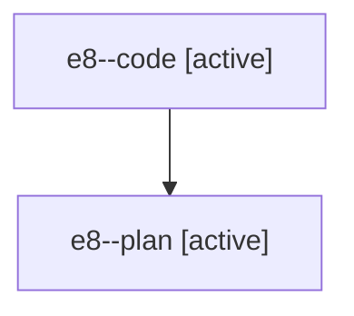

# Family: e8

[Agent Hoods](../README.md) / [bbugyi200](../users/bbugyi200/README.md) / [athena](../users/bbugyi200/machines/athena/README.md) / [e8](../users/bbugyi200/machines/athena/hoods/e8/README.md) / e8

Owner: `bbugyi200.athena` · Hood: `e8` · Members: 2

## Lineage

The diagram is an optional enhancement; the ordered table below contains the same lineage in accessible text.

| Role | Agent | State | Model / provider | Timing | Commits | Prompt | Chat |
|---|---|---|---|---|---:|---|---|
| code | e8--code | active | gpt-5.6-sol / codex | 2026-07-19T02:41:51.543244+00:00 | [1](../agents/bbugyi200.athena.e8--code/README.md#commits) | — | — |
| plan | e8--plan | active | claude-fable-5 / claude | 2026-07-19T02:33:01.586864+00:00 | 0 | [Prompt](../agents/bbugyi200.athena.e8--plan/prompt.md) | [Chat](../agents/bbugyi200.athena.e8--plan/chat.md) |

## Commits

| Role | Repo | Commit | Subject | Committed |
|---|---|---|---|---|
| code | sase | [`185469e`](https://github.com/sase-org/sase/commit/185469e09dc7c42908e9b0ecd2bc4674eb0eaa65) | fix(plugins): preflight stale local install sources | 2026-07-19 03:19:24 UTC |

## Neighbors

| Agent | Relation | State |
|---|---|---|
| [e8.f0](../agents/bbugyi200.athena.e8.f0/README.md) | descendant | active |
