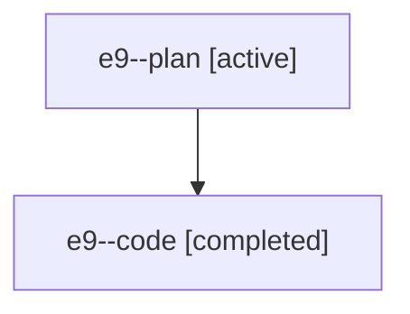

# Family: e9

[Agent Hoods](../README.md) / [bbugyi200](../users/bbugyi200/README.md) / [athena](../users/bbugyi200/machines/athena/README.md) / [e9](../users/bbugyi200/machines/athena/hoods/e9/README.md) / e9

Owner: `bbugyi200.athena` · Hood: `e9` · Members: 2

## Lineage

The diagram is an optional enhancement; the ordered table below contains the same lineage in accessible text.

| Role | Agent | State | Model / provider | Timing | Commits | Prompt | Chat |
|---|---|---|---|---|---:|---|---|
| plan | e9--plan | active | gpt-5.6-sol / codex | 2026-07-19T11:10:07.935193+00:00 | 0 | [Prompt](../agents/bbugyi200.athena.e9--plan/prompt.md) | [Chat](../agents/bbugyi200.athena.e9--plan/chat.md) |
| code | e9--code | completed | gpt-5.6-sol / codex | 2026-07-19T11:12:47.642084+00:00 | [1](../agents/bbugyi200.athena.e9--code/README.md#commits) | — | [Chat](../agents/bbugyi200.athena.e9--code/chat.md) |

## Commits

| Role | Repo | Commit | Subject | Committed |
|---|---|---|---|---|
| code | sase | [`be0c9b5`](https://github.com/sase-org/sase/commit/be0c9b5c4b3be9e518245ec22b70684058f6fd71) | feat(ace): add prompt stash delete-all action | 2026-07-19 07:27:13 EDT |
