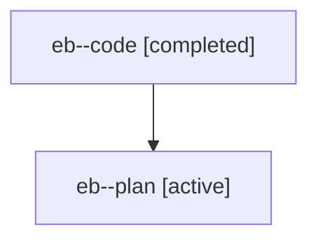

# Family: eb

[Agent Hoods](../README.md) / [bbugyi200](../users/bbugyi200/README.md) / [athena](../users/bbugyi200/machines/athena/README.md) / [eb](../users/bbugyi200/machines/athena/hoods/eb/README.md) / eb

Owner: `bbugyi200.athena` · Hood: `eb` · Members: 2

## Lineage

The diagram is an optional enhancement; the ordered table below contains the same lineage in accessible text.

| Role | Agent | State | Model / provider | Timing | Commits | Prompt | Chat |
|---|---|---|---|---|---:|---|---|
| code | eb--code | completed | gpt-5.6-sol / codex | 2026-07-19T11:18:07.474640+00:00 | [1](../agents/bbugyi200.athena.eb--code/README.md#commits) | — | [Chat](../agents/bbugyi200.athena.eb--code/chat.md) |
| plan | eb--plan | active | gpt-5.6-sol / codex | 2026-07-19T11:12:11.669537+00:00 | 0 | [Prompt](../agents/bbugyi200.athena.eb--plan/prompt.md) | [Chat](../agents/bbugyi200.athena.eb--plan/chat.md) |

## Commits

| Role | Repo | Commit | Subject | Committed (UTC) |
|---|---|---|---|---|
| code | sase | [`5a5d07d`](https://github.com/sase-org/sase/commit/5a5d07d62eeb2abe60159a01bffec71c8fc4462e) | fix(tui): preserve selected tribe header marker | 2026-07-19 11:34:49 |
