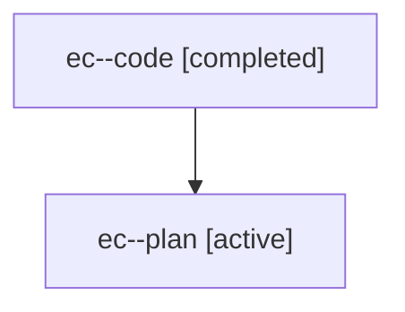

# Family: ec

[Agent Hoods](../README.md) / [bbugyi200](../users/bbugyi200/README.md) / [athena](../users/bbugyi200/machines/athena/README.md) / [ec](../users/bbugyi200/machines/athena/hoods/ec/README.md) / ec

Owner: `bbugyi200.athena` · Hood: `ec` · Members: 2

## Lineage

The diagram is an optional enhancement; the ordered table below contains the same lineage in accessible text.

| Role | Agent | State | Model / provider | Timing | Commits | Prompt | Chat |
|---|---|---|---|---|---:|---|---|
| code | ec--code | completed | gpt-5.6-sol / codex | 2026-07-19T11:25:22.233339+00:00 | [1](../agents/bbugyi200.athena.ec--code/README.md#commits) | — | [Chat](../agents/bbugyi200.athena.ec--code/chat.md) |
| plan | ec--plan | active | gpt-5.6-sol / codex | 2026-07-19T11:13:39.900756+00:00 | 0 | [Prompt](../agents/bbugyi200.athena.ec--plan/prompt.md) | [Chat](../agents/bbugyi200.athena.ec--plan/chat.md) |

## Commits

| Role | Repo | Commit | Subject | Committed |
|---|---|---|---|---|
| code | sase | [`a1b6b0a`](https://github.com/sase-org/sase/commit/a1b6b0a3e1587c82b6836ec458326a4b6ece7d37) | fix(tui): restore admin center digit keymaps | 2026-07-19 07:36:14 EDT |
