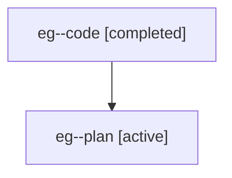

# Family: eg

[Agent Hoods](../README.md) / [bbugyi200](../users/bbugyi200/README.md) / [athena](../users/bbugyi200/machines/athena/README.md) / [eg](../users/bbugyi200/machines/athena/hoods/eg/README.md) / eg

Owner: `bbugyi200.athena` · Hood: `eg` · Members: 2

## Lineage

The diagram is an optional enhancement; the ordered table below contains the same lineage in accessible text.

| Role | Agent | State | Model / provider | Timing | Commits | Prompt | Chat |
|---|---|---|---|---|---:|---|---|
| code | eg--code | completed | gpt-5.6-sol / codex | 2026-07-19T12:07:10.249480+00:00 | [1](../agents/bbugyi200.athena.eg--code/README.md#commits) | — | [Chat](../agents/bbugyi200.athena.eg--code/chat.md) |
| plan | eg--plan | active | gpt-5.6-sol / codex | 2026-07-19T11:56:39.821688+00:00 | 0 | [Prompt](../agents/bbugyi200.athena.eg--plan/prompt.md) | [Chat](../agents/bbugyi200.athena.eg--plan/chat.md) |

## Commits

| Role | Repo | Commit | Subject | Committed |
|---|---|---|---|---|
| code | sase | [`415704d`](https://github.com/sase-org/sase/commit/415704d977268315d286f368640f58fd0af0e127) | feat(ace)!: move fold selector to direct L shortcut | 2026-07-19 12:35:00 UTC |
