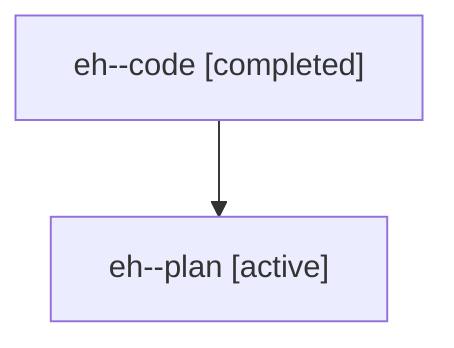

# Family: eh

[Agent Hoods](../README.md) / [bbugyi200](../users/bbugyi200/README.md) / [athena](../users/bbugyi200/machines/athena/README.md) / [eh](../users/bbugyi200/machines/athena/hoods/eh/README.md) / eh

Owner: `bbugyi200.athena` · Hood: `eh` · Members: 2

## Lineage

The diagram is an optional enhancement; the ordered table below contains the same lineage in accessible text.

| Role | Agent | State | Model / provider | Timing | Commits | Prompt | Chat |
|---|---|---|---|---|---:|---|---|
| code | eh--code | completed | gpt-5.6-sol / codex | 2026-07-19T12:06:43.541921+00:00 | 0 | — | [Chat](../agents/bbugyi200.athena.eh--code/chat.md) |
| plan | eh--plan | active | gpt-5.6-sol / codex | 2026-07-19T11:58:30.812276+00:00 | 0 | [Prompt](../agents/bbugyi200.athena.eh--plan/prompt.md) | [Chat](../agents/bbugyi200.athena.eh--plan/chat.md) |
