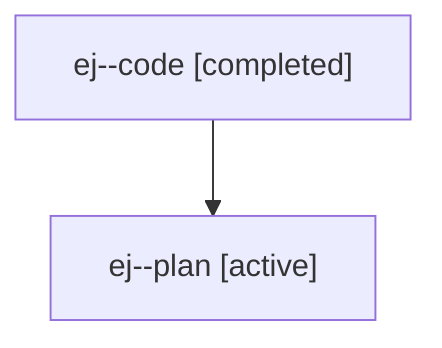

# Family: ej

[Agent Hoods](../README.md) / [bbugyi200](../users/bbugyi200/README.md) / [athena](../users/bbugyi200/machines/athena/README.md) / [ej](../users/bbugyi200/machines/athena/hoods/ej/README.md) / ej

Owner: `bbugyi200.athena` · Hood: `ej` · Members: 2

## Lineage

The diagram is an optional enhancement; the ordered table below contains the same lineage in accessible text.

| Role | Agent | State | Model / provider | Timing | Commits | Prompt | Chat |
|---|---|---|---|---|---:|---|---|
| code | ej--code | completed | gpt-5.6-sol / codex | 2026-07-19T12:21:16.285608+00:00 | 0 | — | [Chat](../agents/bbugyi200.athena.ej--code/chat.md) |
| plan | ej--plan | active | gpt-5.6-sol / codex | 2026-07-19T12:14:18.422108+00:00 | 0 | [Prompt](../agents/bbugyi200.athena.ej--plan/prompt.md) | [Chat](../agents/bbugyi200.athena.ej--plan/chat.md) |

## Commits

| Role | Repo | Commit | Subject | Committed |
|---|---|---|---|---|
| — | sase | [`04a7254`](https://github.com/sase-org/sase/commit/04a725461b302838c641abfe759083c4a0b9d468) | feat(ace): isolate selected tribe panel with capital H | 2026-07-19 08:42:05 EDT |
