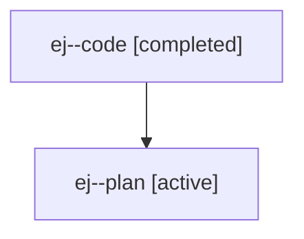

# Family: ej

Owner: `bbugyi200.athena` · Hood: `ej` · Members: 2

## Lineage

The diagram is an optional enhancement; the ordered table below contains the same lineage in accessible text.

| Role | Agent | State | Model / provider | Timing | Commits | Prompt | Chat |
|---|---|---|---|---|---:|---|---|
| code | ej--code | completed | gpt-5.6-sol / codex | 2026-07-19T12:21:16.285608+00:00 | 0 | — | [Chat](../agents/bbugyi200.athena.ej--code/chat.md) |
| plan | ej--plan | active | gpt-5.6-sol / codex | 2026-07-19T12:14:18.422108+00:00 | 0 | [Prompt](../agents/bbugyi200.athena.ej--plan/prompt.md) | [Chat](../agents/bbugyi200.athena.ej--plan/chat.md) |
