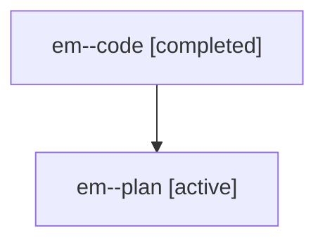

# Family: em

[Agent Hoods](../README.md) / [bbugyi200](../users/bbugyi200/README.md) / [athena](../users/bbugyi200/machines/athena/README.md) / [em](../users/bbugyi200/machines/athena/hoods/em/README.md) / em

Owner: `bbugyi200.athena` · Hood: `em` · Members: 2

## Lineage

The diagram is an optional enhancement; the ordered table below contains the same lineage in accessible text.

| Role | Agent | State | Model / provider | Timing | Commits | Prompt | Chat |
|---|---|---|---|---|---:|---|---|
| code | em--code | completed | gpt-5.6-sol / codex | 2026-07-19T12:37:26.954844+00:00 | [1](../agents/bbugyi200.athena.em--code/README.md#commits) | — | [Chat](../agents/bbugyi200.athena.em--code/chat.md) |
| plan | em--plan | active | gpt-5.6-sol / codex | 2026-07-19T12:27:36.305002+00:00 | 0 | [Prompt](../agents/bbugyi200.athena.em--plan/prompt.md) | [Chat](../agents/bbugyi200.athena.em--plan/chat.md) |

## Commits

| Role | Repo | Commit | Subject | Committed |
|---|---|---|---|---|
| code | sase | [`34d533f`](https://github.com/sase-org/sase/commit/34d533f54e765b947aae9dac78fd4511448e1630) | fix: recognize adjacent inline code in xprompt overlays | 2026-07-19 13:18:20 UTC |
