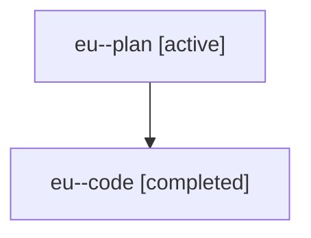

# Family: eu

Owner: `bbugyi200.athena` · Hood: `eu` · Members: 2

## Lineage

The diagram is an optional enhancement; the ordered table below contains the same lineage in accessible text.

| Role | Agent | State | Model / provider | Timing | Commits | Prompt | Chat |
|---|---|---|---|---|---:|---|---|
| plan | eu--plan | active | gpt-5.6-sol / codex | 2026-07-19T13:01:42.982278+00:00 | 0 | [Prompt](../agents/bbugyi200.athena.eu--plan/prompt.md) | [Chat](../agents/bbugyi200.athena.eu--plan/chat.md) |
| code | eu--code | completed | gpt-5.6-sol / codex | 2026-07-19T13:19:05.453343+00:00 | 1 | — | [Chat](../agents/bbugyi200.athena.eu--code/chat.md) |
