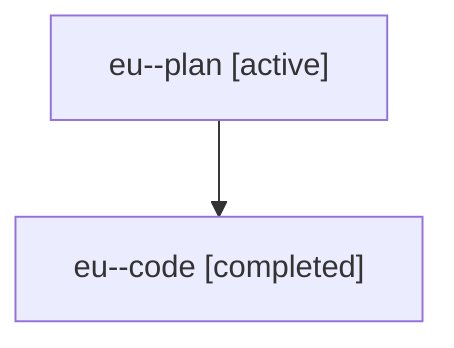

# Family: eu

[Agent Hoods](../README.md) / [bbugyi200](../users/bbugyi200/README.md) / [athena](../users/bbugyi200/machines/athena/README.md) / [eu](../users/bbugyi200/machines/athena/hoods/eu/README.md) / eu

Owner: `bbugyi200.athena` · Hood: `eu` · Members: 2

## Lineage

The diagram is an optional enhancement; the ordered table below contains the same lineage in accessible text.

| Role | Agent | State | Model / provider | Timing | Commits | Prompt | Chat |
|---|---|---|---|---|---:|---|---|
| plan | eu--plan | active | gpt-5.6-sol / codex | 2026-07-19T13:01:42.982278+00:00 | 0 | [Prompt](../agents/bbugyi200.athena.eu--plan/prompt.md) | [Chat](../agents/bbugyi200.athena.eu--plan/chat.md) |
| code | eu--code | completed | gpt-5.6-sol / codex | 2026-07-19T13:19:05.453343+00:00 | [1](../agents/bbugyi200.athena.eu--code/README.md#commits) | — | [Chat](../agents/bbugyi200.athena.eu--code/chat.md) |

## Commits

| Role | Commit | Subject | Committed (UTC) |
|---|---|---|---|
| code | [`28321d8`](https://github.com/sase-org/sase/commit/28321d8dfc18fcca4da201a9d3a6a3eeaae102fc) | fix(ace): project concrete family member state | 2026-07-19 13:59:20 |
