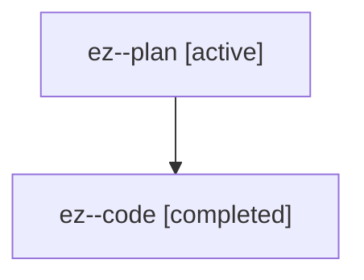

# Family: ez

[Agent Hoods](../README.md) / [bbugyi200](../users/bbugyi200/README.md) / [athena](../users/bbugyi200/machines/athena/README.md) / [ez](../users/bbugyi200/machines/athena/hoods/ez/README.md) / ez

Owner: `bbugyi200.athena` · Hood: `ez` · Members: 2

## Lineage

The diagram is an optional enhancement; the ordered table below contains the same lineage in accessible text.

| Role | Agent | State | Model / provider | Timing | Commits | Prompt | Chat |
|---|---|---|---|---|---:|---|---|
| plan | ez--plan | active | gpt-5.6-sol / codex | 2026-07-19T14:26:10.476854+00:00 | 0 | [Prompt](../agents/bbugyi200.athena.ez--plan/prompt.md) | [Chat](../agents/bbugyi200.athena.ez--plan/chat.md) |
| code | ez--code | completed | gpt-5.6-sol / codex | 2026-07-19T14:29:46.876836+00:00 | [1](../agents/bbugyi200.athena.ez--code/README.md#commits) | — | [Chat](../agents/bbugyi200.athena.ez--code/chat.md) |

## Commits

| Role | Commit | Subject | Committed (UTC) |
|---|---|---|---|
| code | [`ee3242b`](https://github.com/sase-org/sase/commit/ee3242bce534d1c12e141691bf37e9a398e9862e) | feat(ace): toggle metadata folds at scale extremes | 2026-07-19 14:51:53 |
