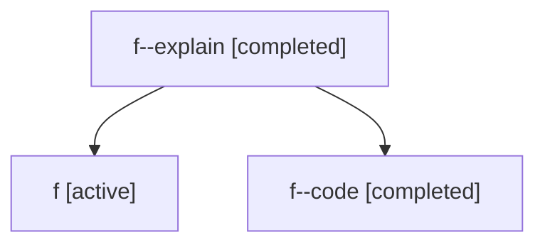

# Family: f

Owner: `bbugyi200.athena` · Hood: `f` · Members: 3

## Lineage

The diagram is an optional enhancement; the ordered table below contains the same lineage in accessible text.

| Role | Agent | State | Model / provider | Timing | Commits | Prompt | Chat |
|---|---|---|---|---|---:|---|---|
| explain | f--explain | completed | gpt-5.5 / codex | 2026-07-06T17:51:16.320112+00:00 | 0 | [Prompt](../agents/bbugyi200.athena.f--explain/prompt.md) | [Chat](../agents/bbugyi200.athena.f--explain/chat.md) |
| root | f | active | claude-fable-5 / claude | 2026-07-06T17:23:25.622460+00:00 | 2 | [Prompt](../agents/bbugyi200.athena.f/prompt.md) | [Chat](../agents/bbugyi200.athena.f/chat.md) |
| code | f--code | completed | gpt-5.5 / codex | 2026-07-06T17:32:22.698783+00:00 | 0 | — | [Chat](../agents/bbugyi200.athena.f--code/chat.md) |
