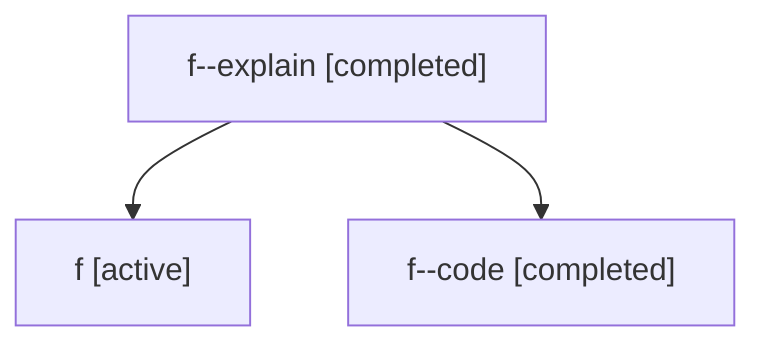

# Family: f

[Agent Hoods](../README.md) / [bbugyi200](../users/bbugyi200/README.md) / [athena](../users/bbugyi200/machines/athena/README.md) / [f](../users/bbugyi200/machines/athena/hoods/f/README.md) / f

Owner: `bbugyi200.athena` · Hood: `f` · Members: 3

## Lineage

The diagram is an optional enhancement; the ordered table below contains the same lineage in accessible text.

| Role | Agent | State | Model / provider | Timing | Commits | Prompt | Chat |
|---|---|---|---|---|---:|---|---|
| explain | f--explain | completed | gpt-5.5 / codex | 2026-07-06T17:51:16.320112+00:00 | 0 | [Prompt](../agents/bbugyi200.athena.f--explain/prompt.md) | [Chat](../agents/bbugyi200.athena.f--explain/chat.md) |
| root | f | active | claude-fable-5 / claude | 2026-07-06T17:23:25.622460+00:00 | [1](../agents/bbugyi200.athena.f/README.md#commits) | [Prompt](../agents/bbugyi200.athena.f/prompt.md) | [Chat](../agents/bbugyi200.athena.f/chat.md) |
| code | f--code | completed | gpt-5.5 / codex | 2026-07-06T17:32:22.698783+00:00 | [1](../agents/bbugyi200.athena.f--code/README.md#commits) | — | [Chat](../agents/bbugyi200.athena.f--code/chat.md) |

## Commits

| Role | Repo | Commit | Subject | Committed |
|---|---|---|---|---|
| root | sase | [`9560818`](https://github.com/sase-org/sase/commit/9560818891754e12f4f25a9d34a692f83cf2945f) | chore: Add SDD prompt and plan for tui\_launch\_approval\_dispatch | 2026-07-06 13:32:21 EDT |
| code | sase | [`95f03c9`](https://github.com/sase-org/sase/commit/95f03c96be0b98c8694d1e0281575ec0a2100ffb) | fix(tui): dispatch launch approvals in background | 2026-07-06 13:44:10 EDT |
