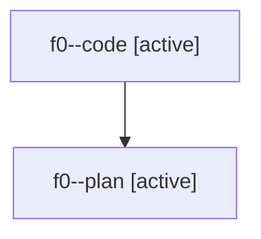

# Family: f0

Owner: `bbugyi200.athena` · Hood: `f0` · Members: 2

## Lineage

The diagram is an optional enhancement; the ordered table below contains the same lineage in accessible text.

| Role | Agent | State | Model / provider | Timing | Commits | Prompt | Chat |
|---|---|---|---|---|---:|---|---|
| code | f0--code | active | gpt-5.6-sol / codex | 2026-07-19T14:53:34.912436+00:00 | 0 | — | — |
| plan | f0--plan | active | claude-fable-5 / claude | 2026-07-19T14:35:48.779665+00:00 | 0 | [Prompt](../agents/bbugyi200.athena.f0--plan/prompt.md) | [Chat](../agents/bbugyi200.athena.f0--plan/chat.md) |
