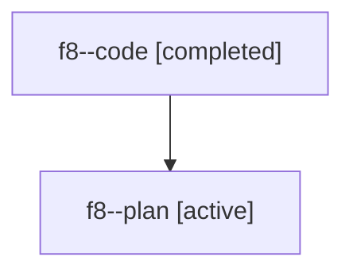

# Family: f8

Owner: `bbugyi200.athena` · Hood: `f8` · Members: 2

## Lineage

The diagram is an optional enhancement; the ordered table below contains the same lineage in accessible text.

| Role | Agent | State | Model / provider | Timing | Commits | Prompt | Chat |
|---|---|---|---|---|---:|---|---|
| code | f8--code | completed | gpt-5.6-sol / codex | 2026-07-19T18:02:08.508892+00:00 | 1 | — | [Chat](../agents/bbugyi200.athena.f8--code/chat.md) |
| plan | f8--plan | active | claude-fable-5 / claude | 2026-07-19T17:53:14.893716+00:00 | 0 | [Prompt](../agents/bbugyi200.athena.f8--plan/prompt.md) | [Chat](../agents/bbugyi200.athena.f8--plan/chat.md) |
