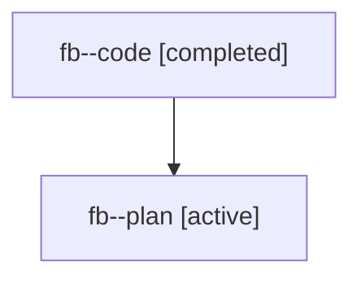

# Family: fb

Owner: `bbugyi200.athena` · Hood: `fb` · Members: 2

## Lineage

The diagram is an optional enhancement; the ordered table below contains the same lineage in accessible text.

| Role | Agent | State | Model / provider | Timing | Commits | Prompt | Chat |
|---|---|---|---|---|---:|---|---|
| code | fb--code | completed | gpt-5.6-sol / codex | 2026-07-19T19:13:33.964793+00:00 | 1 | — | [Chat](../agents/bbugyi200.athena.fb--code/chat.md) |
| plan | fb--plan | active | claude-fable-5 / claude | 2026-07-19T19:05:13.695219+00:00 | 0 | [Prompt](../agents/bbugyi200.athena.fb--plan/prompt.md) | [Chat](../agents/bbugyi200.athena.fb--plan/chat.md) |
