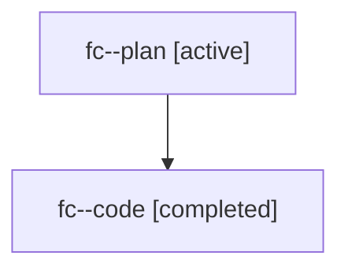

# Family: fc

[Agent Hoods](../README.md) / [bbugyi200](../users/bbugyi200/README.md) / [athena](../users/bbugyi200/machines/athena/README.md) / [fc](../users/bbugyi200/machines/athena/hoods/fc/README.md) / fc

Owner: `bbugyi200.athena` · Hood: `fc` · Members: 2

## Lineage

The diagram is an optional enhancement; the ordered table below contains the same lineage in accessible text.

| Role | Agent | State | Model / provider | Timing | Commits | Prompt | Chat |
|---|---|---|---|---|---:|---|---|
| plan | fc--plan | active | claude-fable-5 / claude | 2026-07-19T20:11:00.627199+00:00 | [1](../agents/bbugyi200.athena.fc--plan/README.md#commits) | [Prompt](../agents/bbugyi200.athena.fc--plan/prompt.md) | [Chat](../agents/bbugyi200.athena.fc--plan/chat.md) |
| code | fc--code | completed | gpt-5.6-sol / codex | 2026-07-19T20:20:20.596080+00:00 | 0 | — | [Chat](../agents/bbugyi200.athena.fc--code/chat.md) |

## Commits

| Role | Commit | Subject | Committed (UTC) |
|---|---|---|---|
| plan | [`f452c6b`](https://github.com/sase-org/sase/commit/f452c6ba36870f87f8b74f9c218b3c6450c57e94) | test: isolate non-lock retry assertion (sase-7n) | 2026-07-19 20:27:59 |
