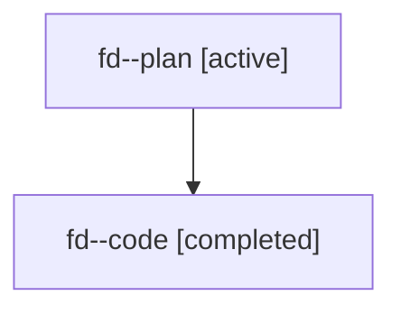

# Family: fd

[Agent Hoods](../README.md) / [bbugyi200](../users/bbugyi200/README.md) / [athena](../users/bbugyi200/machines/athena/README.md) / [fd](../users/bbugyi200/machines/athena/hoods/fd/README.md) / fd

Owner: `bbugyi200.athena` · Hood: `fd` · Members: 2

## Lineage

The diagram is an optional enhancement; the ordered table below contains the same lineage in accessible text.

| Role | Agent | State | Model / provider | Timing | Commits | Prompt | Chat |
|---|---|---|---|---|---:|---|---|
| plan | fd--plan | active | gpt-5.6-sol / codex | 2026-07-19T20:16:11.732962+00:00 | 0 | [Prompt](../agents/bbugyi200.athena.fd--plan/prompt.md) | [Chat](../agents/bbugyi200.athena.fd--plan/chat.md) |
| code | fd--code | completed | gpt-5.6-sol / codex | 2026-07-19T20:20:04.993246+00:00 | [1](../agents/bbugyi200.athena.fd--code/README.md#commits) | — | [Chat](../agents/bbugyi200.athena.fd--code/chat.md) |

## Commits

| Role | Repo | Commit | Subject | Committed |
|---|---|---|---|---|
| code | sase | [`efed1d5`](https://github.com/sase-org/sase/commit/efed1d59eea5f7071fa2f87ed323c8dfd8ea6f53) | feat(tui): highlight selected tribe panel title | 2026-07-19 16:30:04 EDT |
